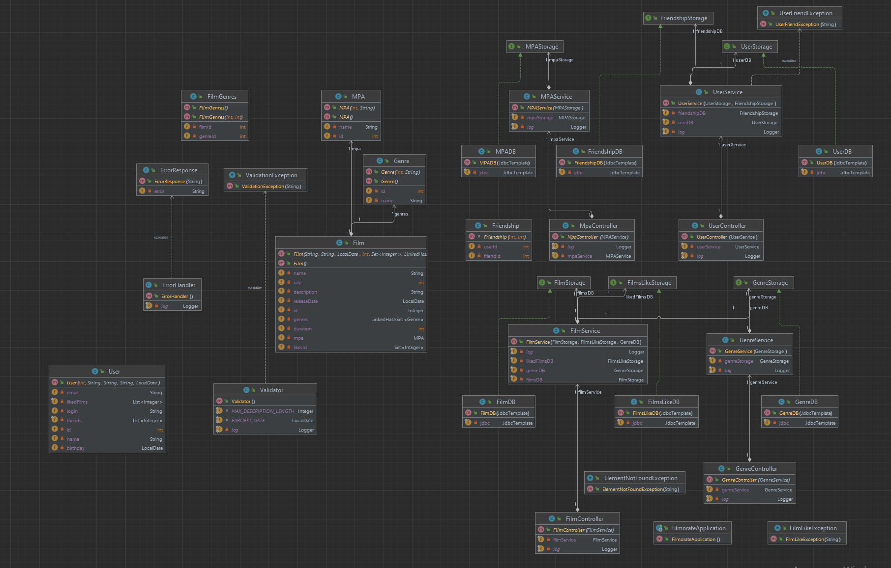

# java-filmorate

# 🎬  Сервис по оцениванию и рекомендации фильмов. Добро пожаловать***! 📽️   

Этот проект направлен на то, чтобы облегчить выбор фильмов в мире, где выбор фильмов кажется бесконечным.
Благодаря созданию внутреннего сервиса для составления рейтингов и рекомендаций фильмов, этот проект позволяет пользователям
быстро находить фильмы с самым высоким рейтингом, не тратя часы на просмотр списков.


## 🚀  Обзор проекта
В связи с огромным количеством фильмов, выходящих на экраны каждый год, выбор подходящего фильма может оказаться непростой задачей.
Рейтинги могут помочь, но когда их так много, трудно понять, с чего начать. Этот проект предлагает простое и эффективное решение — серверную часть, которая:

- 📊 Управляет рейтингами фильмов и пользователей
- 🎯 Возвращает топ лучших рекомендованных фильмов на основе оценок пользователей  
Благодаря этому сервису вы и ваши друзья можете легко найти, что посмотреть, экономя время и избегая утомительного выбора.

## 🛠️ Архитектура & Технологи
Этот проект представляет собой ** монолитный сервис Spring Boot**, разработанный как минимально жизнеспособный продукт (MVP) для системы рекомендаций фильмов. 
Серверная часть основана на базе ** базы данных H2**, что делает его легким и идеальным для тестирования. 
### Ключевые компоненты:
- **Spring Boot**: Обеспечивает структурированную и быструю внутреннюю среду разработки.
- **H2 Database**: Встроенная база данных, идеально подходящая для локальной разработки. 
- **Java**: Основной язык программирования для создания надежных, масштабируемых серверных приложений.  
### Фичи:
- **Управление рейтингами фильмов**: Пользователи могут выставлять оценки фильмам.
- **Топы рекомендаций**: Сервис возвращает список из лучших рекомендуемых фильмов на основе текущих рейтингов.
- **Коммуникация**: Пользователи могут обмениваться друг с другом мнениями по поводу фильмов посредством комментариев под ними.
### Cхемы:
- **[ER-диаграмма](https://dbdiagram.io/d/65f37ee1b1f3d4062cf9174a):**    
  
- **UML-диаграмма:**
  

## 📦 Project Structure  Here's a quick overview of the core folders and files in this repository:`

📦 MovieRecommendationBackend  
    ├── src  
    │ ├── main   
    │ │ ├── java   
    │ │ │ └── com.example.moviebackend   
    │ │ └── resources  
    │ │ ├── application.properties   
    │ │ └── data.sql  
    └── README.md  

```

- **src/main/java**: Содержит внутреннюю логику, организованную в контроллеры, службы и репозитории.
- **src/main/resources**:
  - `application.properties`: Конфигурация для приложения Spring Boot.
  - `data.sql`: Пример данных для инициализации базы данных.

## 🔧 Getting Started

Следуйте этим инструкциям, чтобы настроить проект локально.

### Необходимые компоненты

- **Java 11** или выше
- **Maven** для управления зависимостями

### Installation

1. **Clone the repository**
   ```bash
   git clone https://github.com/yourusername/MovieRecommendationBackend.git
   cd MovieRecommendationBackend
```

2. **Build the project**

   bashCopy code

   `mvn clean install`

3. **Run the application**

   bashCopy code

   `mvn spring-boot:run`

4. **Access the API**  
   The service will start at `http://localhost:8080`. You can interact with the endpoints using tools like [Postman](https://www.postman.com/ "https://www.postman.com/") or `curl`.


### API Endpoints

- `GET /movies/recommendations`  
  Retrieves the top 5 movie recommendations based on user ratings.

- `POST /movies/{id}/rate`  
  Allows users to submit a rating for a specific movie.


## 🧪 Testing

To run tests, use:

bashCopy code

`mvn test`

## 🚧 Будущие улучшения

Это версия MVP, и будущие улучшения могут включать в себя:

- 🌐 Поддержку нескольких баз данных (например, MySQL, PostgreSQL)
- 📈 Улучшенные алгоритмы рекомендаций для получения более персонализированных результатов
- 🔑 Аутентификацию пользователей и профили для получения индивидуальных рекомендаций

## 🤝 Внесение вклада

Приветствуется внесение вклада! Не стесняйтесь разветвлять проект и отправлять запросы на обновление.

1. Разветвите репозиторий
2. Создайте ветвь функциональности ("`git checkout -b feature/Your Feature`").
3. Зафиксируйте свои изменения ("`git commit -m 'Add feature`")
4. Нажмите на ветку ("`git push origin feature/Your Feature`").
5. Откройте запрос на извлечение

---

Удачного кодирования и наслаждайтесь рекомендациями по просмотру фильмов! 🍿

```

Дайте мне знать, если вы захотите внести какие-либо изменения в этот шаблон!
```